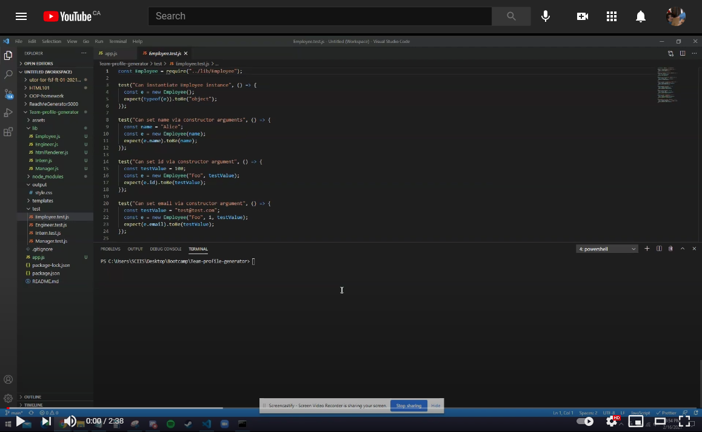

## Team profile generator


## Description

Once prompted, answer a series of questions to add your team members to an incredibly stylish site. It's that easy!

## Table of Contents

- [Installation](#Installation)
- [Usage](#Usage)
- [License](#License)
- [Contributing](#Contributing)
- [Tests](#Tests)

## Installation

To download, click the green "code" button in the top right, and copy paste that link into git bash.


$git clone link


Once you've opened your folder, `npm init` to that folder

Then `npm install inquirer`

Repeat `npm init` `npm install jest`

You now have the node modules necessary to complete the code

## Usage

[](https://www.youtube.com/watch?v=3GWKQ-hC3YA&feature=youtu.be)

## Tests

Automated tests are run using Jest: `npm run jest`

### Break down of tests

The tests checks if the class models are correclty coded. Here's one for example:

```
test("getRole() should return \"Employee\"", () => {
  const testValue = "Employee";
  const e = new Employee("Alice", 1, "test@test.com");
  expect(e.getRole()).toBe(testValue);
});
```
For the class
```
class Employee {
    constructor ( name, id, email){
        this.name = name
        this.id = id
        this.email = email
    }
    getName (){
        return this.name
    }
    getId(){
        return this.id
    }
    getEmail(){
        return this.email
    }
    getRole(){
        return "Employee"
    }
}
```

## Built with

* [Jest](https://www.npmjs.com/package/jest) - Used for automated testing
* [Inquirer](https://www.npmjs.com/package/inquirer) - The user interface and the inquiry session flow provider
* [Nodejs](https://nodejs.org/en/) - Used to launch the application

## Contributing

There are many ways in which you can participate in the project, for example: 
* Submit bugs and feature requests to the email below, and help us verify as they are checked in 
* Review source code changes
* Review the documentation and make pull requests for anything from typos to new content

## License

MIT

## Questions

For any additional questions see my [GitHub profile](http://github.com/tylerpetri) or contact tylerpetri@hotmail.com