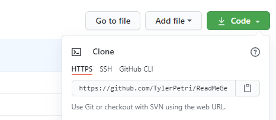

## Team profile generator

## Description

Once prompted, answer a series of questions to add your team members to an incredibly stylish site. It's that easy!

## Table of Contents

- [Installation](#Installation)
- [Usage](#Usage)
- [License](#License)
- [Contributing](#Contributing)
- [Tests](#Tests)

## Installation

To download, click the green "code" button in the top right, and copy paste that link into git bash.

$git clone link

Once you've opened your folder, `npm init` to that folder

Then `npm install inquirer`

Repeat `npm init` `npm install jest`

You now have the node modules necessary to complete the code

## Usage

## License

MIT

## Contributing

There are many ways in which you can participate in the project, for example: 
* Submit bugs and feature requests to the email below, and help us verify as they are checked in 
* Review source code changes
* Review the documentation and make pull requests for anything from typos to new content

## Tests

Test using npm jest

## Questions

For any additional questions see my [GitHub profile](http://github.com/tylerpetri) or contact tylerpetri@hotmail.com